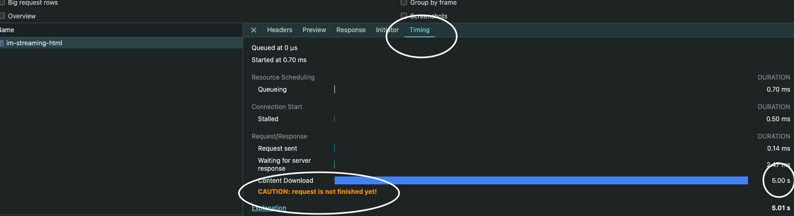

# SSR and RSC Intro

Hi. You have heard about about Serverside Rendering, Suspense/Streaming, and React Server Components.

My goal is to explain each concept **in isolation**.

I think it is really important to separate these concepts, because a lot of guides, tutorials, and meta-frameworks lump them into one "thing". The reality is, they are all independent concepts. You can use any combination of these. You can also use none of these.

Most likely, you are using a meta-framework like Next.JS and letting that meta-framework decide for you. Well in that case, how about a peek under the hood?

To give you solid understanding, I am going to break out each of these into separate topics:

- Serverside Rendering
- Suspense and Streaming
- React Server Components

Let's get started.

# SECTION 1: Your First Serverside Rendering

At the most basic, server side rendering is something that generates HTML during runtime on the server, and delivers it to the client. So in my example, you see the most straightforward example of serverside rendering: I generate a string containing HTML and insert my dynamic content in to the string. The string is then delivered to the client as HTML.

In my example, `localhost:3000/tell-me-the-time` will render an HTML page with the server's timestamp. Refresh and you will get a new timestamp. I included different HTML tags to demonstrate the the browser is indeed parsing the response as valid HTML.

Congratulations. Serverside Rendering.

# SECTION 2: Serverside Rendering React

Now we will beef up our server side rendering, and add support for React! The magic sauce is:

```jsx
const { renderToString } = require("react-dom/server");
```

You can look up the [docs](https://react.dev/reference/react-dom/server/renderToString) for this method. We give it a React component, and it will return the HTML of the React tree as a string.

But Wait!

I will also have to add some transpilation. Right now, if I write JSX, the server will crash on start because it does not recognize JSX format. `SyntaxError: Unexpected token '<'`

So the next import does this for me. Babel will now automatically transpile JSX on the fly.

```jsx
require("@babel/register")({
  extensions: [".jsx"],
  presets: ["@babel/preset-react"],
});
```

Now, I can import my React component.

```jsx
const myFirstApp = require("./my-first-react-app/App.jsx");
```

And I can pass it into `renderToString`, get a string, and send that as HTML in my response.

```jsx
const root = myFirstApp();
const html = renderToString(root);

res.send(`<html><body> ... ${html} ...</body>`);
```

Visit `localhost:3000/my-first-react-app` to see our beautiful React app. Take a look at the React code in `my-first-react-app`. I'm passing props, using the `style` prop, and even some composition. Everything's looking great until...

Until you try clicking the increment button on the counter. Nothing happens. But if you look at the code, I'm using `React.useState()` and `button onClick` to update the counter. What happened?

Right now the client only has raw HTML. It does not have any javascript, so it is not able to "hook up" my interactive component to React features. What we need to do is send some Javascript to the client, and tell it to hook up my component to React. This is the "hydration" step you might have heard of. Indeed, this is more magic sauce from the `react-dom` package. We will do that in the next section.

# SECTION 3: Serverside Rendering React with Clientside Hydration

So we have HTML on the clientside, but the interactive Counter component is not working because there is no Javascript. What is our solution? We will use another API from `react-dom`:

```jsx
ReactDOM.hydrateRoot(document.getElementById("app-root"), <App />);
```

Take a look at the file `client.js`. There I have written a script: It imports react, react-dom, and the App, then it makes the `hydrateRoot` call. This script needs to run on the client, after the initial HTML is rendered.

I use webpack to bundle this `client.js` file and output a `app.bundle.js` file which contains all the source code of React, React DOM, my React Components, in a single file.

Then in the HTML, I add a new line:

```html
<script src="/app.bundle.js"></script>
```

When the client renders the HTML, it will then run into this line and download and run my `app.bundle.js` script. That script will run `hydrateRoot()` and if all is correct, my interactive counter component should be working.

Check it out at `localhost:3000/my-first-react-counter`.

Let's pause and see what we have accomplished: We are rendering React on the serverside, delivering that rendered HTML to the clientside, and then hydrating our application on the clientside so it can be fully interactive. Well done.

In the next section, we will add streaming to our project.

# SECTION 4: Serverside Rendering React with Suspense, Streaming, but WITHOUT Clientside Hydration

I'm going to explain Suspense and Streaming. To do this, let me start by not using them.

Please look at `im-streaming-html/NoStreaming.jsx`. You will see a "Comment Section" application, where each Comment component displays a loader while it is fetching its data. This is done with `useEffect`.

Now look at the server code for `/no-streaming-html` (Line #93). Everything here should look familiar, I am using `renderToString` and hydrating on the clientside. Go ahead and visit http://localhost:3000/no-streaming-html.

Everything looks good right? Each Comment component is "fetching" data and then rerenders when the data loads in. There is a bottleneck:

None of the data fetching can start until hydration is complete. Remember we are using `useEffect`, and that can only be used with React javascript, after hydration. So now we have a waterfall:

1. Render HTML on server and send to client
2. Client receives HTML, downloads Javascript, and hydrates application
3. Comment components start fetching (look at your browser console logs)

This is considered a waterfall because these steps must happen in order, one after the other. Let us see how Suspense and Streaming can mitigate this bottleneck.

- Streams are a [Web API](https://developer.mozilla.org/en-US/docs/Web/API/Streams_API). The main idea is that streams send data in chunks as the data becomes ready, and a receiver can process those chunks immediately as they come in.
- Suspense is a React API that renders a fallback component while its child component is resolving a promise. Using this API, we can render the fallback UI immediately and then stream the updated UI once it is ready.

Please look at `im-streaming-html/Streaming.jsx`. You can see I've implemented the same application, but this time using `<Suspense>`. On the server (Line #111), instead of `renderToString` I use a new API called `renderToPipeableStream`. Now I can stream chunks of data to the client as they become available. You will see this in action.

Go ahead and load this page: http://localhost:3000/im-streaming-html

Ok. So far everything looks the same. But wait, open the console logs in your browser. Nothing there. Check your server logs... The fetching all happened on the server. So how the heck did our client get "new HTML"? Because of streaming.

Open the network inspector in your browser and reload the page. Click the `im-streaming-html` request and look at its "Timing" information.



Notice how the request doesn't actually finish after the initial HTML. It keeps open, receiving new HTML from the server. Eventually the request finishes at around 9 seconds. That's streaming in action. The server is sending HTML to the client for each Comment component as it becomes available.

You can also see this in action using `curL`.

```bash
curl localhost:3000/streaming -N
```

Watch as new HTML comes in every second. This is exactly what's happening in the browser. Notice also that the browser doesn't wait for the request to finish. As new HTML comes in, it is processed and rendered immediately.

So now you see how `Suspense` and `Streaming` is an optimization.

Notice that in the `im-streaming-html` page, I don't actually do any clientside hydration. Let's do that in the next section

# SECTION 5: Serverside Rendering React with Suspense, Streaming, WITH Clientside Hydration

In the previous section we saw Suspense and HTML streaming in action. However, I did not hydrate the clientside application. Let's do that now. I created a new endpoint `/im-streaming-html-with-hydration-broken` that adds a param to `bootstrapScripts`. The script I gave it is a `hydrateRoot()` call, like we have done in previous sections.

Open the page, and check the console logs. Notice that fetching now happens in an infinite loop, and we also get a warning from React:

`A component was suspended by an uncached promise. Creating promises inside a Client Component or hook is not yet supported, except via a Suspense-compatible library or framework.`

The problem is that once we hydrate our application, it creates a new `fetchData` promise on the clientside. Once that `fetchData` promise resolves on the clientside it triggers a rerender that creates a new `fetchData` promise. Thus we get stuck in an infinite loop. Notice the React warning here:

`except via a Suspense-compatible library or framework.`

Unfortunately this is a touchy subject, and React has been criticized for potentially keeping this implementation "secret" to discourage us from integrating with Suspense on our own. Instead, telling us to [rely on a meta-framework](https://react.dev/blog/2022/03/29/react-v18#suspense-in-data-frameworks) like NextJS or Remix. This has been a controversy. What's worse is that a lot of these meta-frameworks implement solutions using "React internals" that technically are not "recommended".

In this example, I am using the `use` hook which is the official way to make a component suspend. However, you can see the infinite loop problem we have.

Check out my solution in `streaming-with-hydration/StreamingWithHydration.jsx` file. I replaced the `fetchData` method with a new one that throws promises instead of returning a promise.

Now you can visit http://localhost:3000/im-streaming-html-with-hydration to see everything working.

The sad truth is that "throwing promises" is not an officially recommended way to suspend a component. And React team warns us that this implementation may change in the future. Meanwhile, meta-frameworks have gone ahead with various implementations to solve this and make `Suspense` + `Streaming` ready for its users.

It is a weird situation where the core library itself doesn't fully support the functionality, but frameworks built around it have gone on and touted as ready for production.

# SECTION 6: React Server Components Introduction

Finally we have arrived to the introduction of React Server Components. In order for this to make the most sense, I'm going to introduce you to RSC in isolation first. Then in the later sections, I will combine RSC with what we learned in previous sections to demonstrate how SSR, Suspense, and RSC all play together to enhance user experience and developer experience.

Without further ado: React Server Components!

With the introduction of RSC, we have a new type of component that only runs on the server (or only runs at build time). The output of that RSC is essentially immutable, so it will never be hydrated or rerendered on the client:

```jsx
const ServerComponent = () => {
  return <div>Hello</div>
}
```

Looks familiar enough? But with RSC we actually write async components that fetch data or do I/O:

```jsx
const ServerComponent = async () => {
  const data = await db.getData();
  return <div>{data.name} - {data.id}</div>
}
```

Now things are looking different. Remember that as a RSC, it only runs once on the server (or once during build, if you are not using SSR). The client will never receive the code for `db` or `data`, it will only get that the output of this component.

The key caveat to RSC is that we can no longer us a large subset of React APIs or add interactivity. For example:

```jsx
// NOT ALLOWED IN RSC: No hooks.
const ServerComponent = () => {
  const [isOpen, setIsOpen] = useState(false)
  ...
}

// NOT ALLOWED IN RSC: No functions passed to components or HTML.
const ServerComponent = () => {
  ...
  return <button onClick={() => console.log('hi')}>Hi</button>
}
```

If you want to do this, then you have to explicitly mark a component as a client component by adding the "use client" directive at the top.

```jsx
"use client";

const ClientComponent = () => {
  const [isOpen, setIsOpen] = useState(false)
  return isOpen ? <p>open</p> : <p>closed</p>
}
```

Server components can be a parents of Client Components, but client component cannot be direct parents of server components. You can pass a server component to a client component as a prop.

That was a 2 minute crash course introduction to React Server Components. There many more details and nuances that can go into this introduction, but this tutorial does not aim to go in-depth. What I really want to do in the next section is show how RSC fits in to this entire architecture with SSR and Suspense/Streaming.

# SECTION 7: Serverside Rendering React with Suspense, Streaming, WITH Clientside Hydration AND React Server Components

Alas, we have arrived.

I have created a brand new server named `rsc-server.js`. And it is started with the command `npm run start-rsc`. When you boot it up, go and visit http://localhost:3000 - the app should look familiar. It's our list of comments being streamed in. But take a look at the network tab, specifically you see a call to an endpoint named `rsc`. Notice that it is no longer streaming raw HTML, but a different type of data format:

```
1:"$Sreact.suspense"
3:{"name":"Comment","env":"Server","key":null,"owner":null,"props":{"commentId":0}}
2:D"$3"
5:{"name":"Comment","env":"Server","key":null,"owner":null,"props":{"commentId":1}}
4:D"$5"
```

This is how we know we are using React Server Components. With RSC, we stream this format of JSON, and then on the clientside, we will consume that JSON to render the HTML.

Take a look at `react-server-components/client.js` and notice that we no longer have `hydrateRoot`. Instead we are using `ReactServerDomWebpack.createFromFetch` and it is calling our `/rsc` endpoint. The `react-server-dom-webpack` is an experimental package published by React to support the new React Server Component architecture. It is able to parse the JSON you see above and render our React application. The huge advantage here is that we are no longer required to hydrate the entire React tree.

That makes sense right? Because so far our React app doesn't actually do any "React" things... It is a pure server component application.

But wait there is more. Take a look at `react-server-components/App.jsx`. Notice that our Comments list looks pretty much the same except we no longer have to deal with any funky `use()` hook or `throw promise` syntax. With React Server Components, we write the `await` straight into the component, and everything is magically wired up to suspend and stream to the client!

There is just one missing piece. What if I actually DO want some interactivity on my website? Well for that, we need to write a Client Component.

# SECTION 8: Conclusion

Thank you so much for joining me on this guided tutorial.

# Additional Resources
- Implement ssr: https://www.youtube.com/watch?v=NwyQONeqRXA
- RSC vs SSR: https://www.youtube.com/watch?v=jEJEFAc8tSI
- RSC nitty-gritty: https://www.plasmic.app/blog/how-react-server-components-work#life-of-an-rsc-render
- RSC from scratch: https://www.youtube.com/watch?v=MaebEqhZR84&pp=ygUocmVhY3Qgc2VydmVyIGNvbXBvbmVudHMgZnJvbSBzY3JhdGNoIGJlbg%3D%3D
- New Suspense SSR Architecture in React 18: https://github.com/reactwg/react-18/discussions/37
- RSC no framework: https://timtech.blog/posts/react-server-components-rsc-no-framework/
- RSC overview https://www.joshwcomeau.com/react/server-components/
- Kent-c-dodds RSC mvp: https://www.youtube.com/watch?v=4S5m5Jhneds
- Data Fetching with RSC: https://www.youtube.com/watch?v=TQQPAU21ZUw&t=1048s